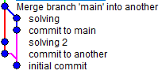

### 0. 유용한 도구

- git bash 혹은 그 외에 사용하는 터미널에 `gitk`를 입력하면 여러분의 커밋 내역을 이쁘게 보여줍니다.
- f5를 눌러 새로고침도 할 수 있으니 요긴하게 사용해 보세요.

### 1. 새 branch 설정하기

1. **터미널/명령 프롬프트 열기**: 저장소 디렉토리로 이동합니다.
2. **현재 branch 확인하기**: `git branch`를 입력하여 현재 branch를 확인합니다. 기본적으로 `main`일 것입니다.
3. **새 branch 생성하기**: `git branch [branch-name]`을 실행하여 새 branch를 생성합니다. `[branch-name]`을 원하는 이름으로 바꾸세요, 예를 들어 `feature`같은 것 말이죠.
4. **새 branch로 전환하기**: `git checkout [branch-name]`을 실행하여 새 branch로 전환합니다.

### 2. 새 branch에서 변경하기

1. **파일 편집하기**: 저장소의 파일을 열고 일부 변경을 합니다. 이것은 텍스트 파일이나 코드 파일 등이 될 수 있습니다.
2. **변경 사항 커밋하기**: 편집 후, `git add *`을 실행하여 변경 사항을 스테이징하고 (절대 평소에는 이러지 마세요!), `git commit -m "your message"`를 실행하여 커밋합니다.
   - 기본 명령어에 대한 더욱 자세한 설명은 [여기](https://git-scm.com/book/ko/v2/Git%EC%9D%98-%EA%B8%B0%EC%B4%88-%EC%88%98%EC%A0%95%ED%95%98%EA%B3%A0-%EC%A0%80%EC%9E%A5%EC%86%8C%EC%97%90-%EC%A0%80%EC%9E%A5%ED%95%98%EA%B8%B0)를 참고하세요.

### 3. 병합 충돌 만들기

1. **메인 branch로 돌아가기**: `git checkout main`를 실행합니다.
2. **동일한 파일 편집하기**: 새 branch에서 편집한 것과 동일한 파일을 다르게 편집합니다.
3. **메인에서 변경 사항 커밋하기**: `git add *`과 `git commit -m "your message"`를 실행합니다.

### 4. 병합 및 충돌

1. **병합 시도하기**: `git merge [branch-name]`을 실행합니다. 이것은 새 branch의 변경 사항을 `main`에 병합하려고 시도합니다. 이때 branch-name은 자신이 편집하고 있는 branch와 다른 branch여야 합니다.
2. **충돌 발생하기**: Git은 파일의 동일한 파일이 두 branch에서 다르게 편집되었기 때문에 충돌 메시지를 출력합니다.
   - merge에 대해 더 자세히 알고 싶다면 [이곳](https://git-scm.com/book/ko/v2/Git-%EB%B8%8C%EB%9E%9C%EC%B9%98-%EB%B8%8C%EB%9E%9C%EC%B9%98%EC%99%80-Merge-%EC%9D%98-%EA%B8%B0%EC%B4%88)을 참고하세요.

### 5. 병합 충돌 해결하기

1. **충돌이 있는 파일 열기**: 충돌이 있는 파일을 엽니다.
2. **충돌 표시자 식별하기**: Git은 충돌을 나타내기 위해 `<<<<<<<`, `=======`, `>>>>>>>`와 같은 표시자를 사용합니다. `=======`윗부분은 당신이 작업하던 branch(HEAD)의 파일 내용, 아랫부분은 merge당하는 branch의 파일 내용입니다.
3. **파일 편집하기**: 어떤 변경 사항을 유지할지 결정합니다. 충돌 표시자를 제거하고 파일을 원하는 대로 편집합니다. 원한다면 `git merge --abort`를 사용하여 merge를 중단한 뒤, 다른 브랜치로 이동하여 그곳의 파일도 편집할 수 있을 겁니다.
4. **해결됨으로 표시하기**: 충돌을 해결한 후, `git add [filename]`을 실행합니다.
5. **병합 완료하기**: `git commit -m "your message"`을 실행합니다. Git은 병합에 대한 커밋 메시지를 입력하기 위해 텍스트 편집기를 엽니다. 저장하고 편집기를 닫습니다.
6. **상태 확인하기**: `git status`를 실행하여 모든 것이 깨끗한지 확인합니다.

### 6. 최종 단계

- **변경 사항 푸시하기**: 원격 저장소를 사용하는 경우, `git push`를 실행하여 변경 사항을 푸시합니다.
- 이때, 현재 branch가 main이어야 합니다.
- **검토하기**: github 리모트 저장소에서 병합이 성공적이었고 예상대로 변경 사항이 있는지 파일을 확인합니다.

제 경우에는 gitk를 통해 확인했을 때, 다음과 같은 커밋 내용을 볼 수 있었습니다.

물론 이는 저의 경우이며, 여러분이 어떤 방식으로 commit을 했는지에 따라 다른 방식으로 나타날 수 있습니다.

이렇게 길이 두 갈래로 나뉘었다가 합쳐지는 모습이 보이면 성공입니다.

push한 뒤 카톡으로 알려주시는 것으로 제출할 수 있습니다.

좋은 경험 되시길 바랍니다.
